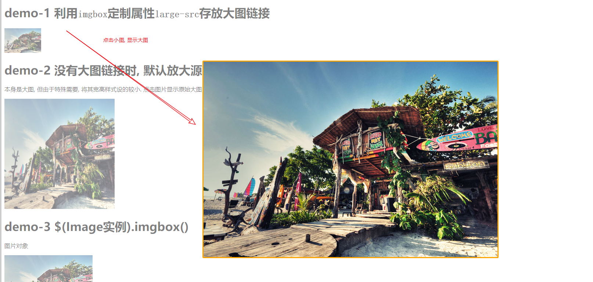

# ImgBox

> 用于点击图片缩略图, 显示大图预览.

本插件仿照jQuery的imgbox实现类似效果.
http://d.lanrentuku.com/down/js/tupian-933/

但jQuery的imbbox没有拖拽效果等一些定制化的需求. 于是, 自己动手, 写了这个
小插件. **功能简洁, 使用方便**.

快速上手请参见: [quick_start.html](./quick_start.html)演示.


## 快速上手

**准备:**

```html
    <link rel="stylesheet" href="css/imgbox-1.0.css"/>
    <script type="text/javascript" src="./js/jquery-1.12.1.min.js"></script>
    <script type="text/javascript" src="js/imgbox-1.0.1.js"></script>
```


首先, 本插件会暴露一个全局实例: `ImgBox`.

```js
//查看全局实例: ImgBox
console.log('查看全局ImgBox实例',ImgBox);
```


### demo 1: 利用`imgbox`的定制属性`large-src`存放大图链接

点击小图, 即可浏览`large-src`中的大图.

**HTML**:

```html

```


**JavaScript:**

```js
/****demo-1****/
$('#demo-1').imgbox();
```


**点击:**




**缩放&拖拽**:


## 定制参数

[定制参数demo](./custom_settings.html)

**HTML**:

```html
<body>
    
    
    
    
    
</body>
```


**JavaScript**:

```js
    $('img').each(function (index,img) {
        $(img).imgbox({
            magnification:2,
            min:0.1,
            max:20,
            degree:index%2==0?0:90  //奇数索引时右旋90deg
        });
    })
```


## Feedback


**Email**: liuhejun108@163.com

**Anthor**: Nisu-Liu